# Agent workspace starter

Eight small files that make a repository readable by a coding agent, and make the agent's
work checkable by a person. Drop them into any repository; nothing here depends on a
language, a framework, or a particular agent.

It is opinionated because vague rules do nothing. Change the opinions; keep the shape.

## The whole system

```mermaid
flowchart LR
  subgraph CONTRACT["THE REPO BINDS EVERY AGENT"]
    A1["<b>AGENTS.md</b><br/>what must pass<br/>what must never happen"]
    A2["<b>DEFINITION-OF-DONE.md</b><br/>proved by output,<br/>never by a sentence"]
    A3["<b>lessons/</b><br/>every mistake is filed here,<br/>with the check that stops it"]
  end

  subgraph WRITE["WRITE · max 3 agents · one worktree each"]
    BRIEF["<b>Brief, in a file</b><br/>task · rules ·<br/>how it gets verified"]
    B1["<b>Builder agent</b><br/>worktree A"]
    B2["<b>Builder agent</b><br/>worktree B"]
    B3["<b>Builder agent</b><br/>worktree C"]
    HOOK(["<b>Session-start hook</b><br/>abandoned worktrees ·<br/>orphaned ports"])
  end

  subgraph GATE["GATE · automatic"]
    T["<b>tests · lint · build</b><br/>then <b>/prove-it</b>:<br/>take away what each new test<br/>protects → it must go RED"]
  end

  subgraph REVIEW["REVIEW · read-only"]
    R["<b>Reviewer agent</b><br/>NO edit · push · merge tools<br/>sees diff + brief, never the chat"]
    F{"Critical or<br/>Important?"}
  end

  subgraph SHIP["SHIP · a person decides"]
    H["<b>A person merges</b><br/>checks the fact,<br/>not the exit code"]
    M["<b>Measure on the live URL</b><br/>several runs · a range"]
  end

  subgraph LEARN["LEARN · so it never costs twice"]
    L["<b>Lesson</b><br/>what happened · why it seemed right<br/>enforced_by: script | none"]
    C["<b>New check</b>"]
  end


  BRIEF --> B1 & B2 & B3
  B1 & B2 & B3 --> T
  T --> R
  R --> F
  F -- "no" --> H
  F -- "yes · findings with file:line" --> B1
  H --> M
  M -- "surprise or regression" --> L
  L --> C
  C -. joins the gate .-> T

  classDef file fill:#EEF1F5,stroke:#B9C2CE,color:#0F1720
  classDef agent fill:#E8EEFC,stroke:#1D4ED8,color:#0F1720,stroke-width:2px
  classDef check fill:#E6F4EC,stroke:#15803D,color:#0F1720,stroke-width:2px
  classDef human fill:#0F1720,stroke:#0F1720,color:#FFFFFF
  classDef learn fill:#FDF0E3,stroke:#B54708,color:#0F1720,stroke-width:2px
  classDef ask fill:#FFFFFF,stroke:#B42318,color:#0F1720,stroke-width:2px
  class A1,A2,A3,BRIEF,HOOK file
  class B1,B2,B3,R agent
  class T,C check
  class H,M human
  class L learn
  class F ask
```

The same diagram as a poster, with what it caught in its first week: [docs/loop.png](docs/loop.png)

| File | What it does |
| --- | --- |
| `AGENTS.md` | The contract the agent reads before it touches anything |
| `docs/DEFINITION-OF-DONE.md` | What "done" means, verified by command output, never by a sentence |
| `.claude/agents/reviewer.md` | An agent that only reviews, and cannot write, push or merge |
| `.claude/skills/prove-it/SKILL.md` | A skill (`/prove-it`) that proves each new test can fail: reverts what the test protects, expects red, restores everything |
| `.claude/skills/workspace-audit/SKILL.md` | A skill (`/workspace-audit`) that measures what every session pays before work starts, finds rules nothing enforces and gates that cannot fail, and ranks what to cut, convert or keep. Read-only |
| `lessons/` + `scripts/check-lessons.mjs` | Every mistake becomes a check, and a script that says when it has not |
| `.claude/hooks/session-start.mjs` | Tells a new session what the last one left unfinished |

## If you already run agents well

You will know most of the shape. These are the parts that are not obvious, each one
learned by paying for it:

**An agent's fake and an agent's code agree by construction.** The dangerous case is
not a missing test, it is a passing one. When the same author writes the code that
calls an API and the stub it is tested against, they are consistent with each other and need not be
consistent with reality — and the suite is green while nothing works. So: one test per
external contract, pinned from the vendor's documentation by hand, fed to the code
*without* passing through your own fake.

**Verify the agent's tests by mutation, every time, not occasionally.** After a suite
goes green, break the thing the test claims to protect and watch it fail. It takes
thirty seconds. In one week of agent-written tests this caught several that passed
identically before and after the change they were written for.

**Give the reviewer no write tools at all.** Not "please do not edit" in the prompt —
no edit tool in its definition. A reviewer that can fix things starts fixing instead of
finding, and you lose the only reading you had that was not already invested in the
work being right.

**Review is not a second opinion, it is a different question.** Reading your own
agent's diff you check whether it did what you asked. An agent with no memory of the
request checks whether it is *right*. That is why the reviewer gets the diff and the
original task but not your conversation.

**Anything that depends on arrival time cannot be measured locally.** Page load,
layout shift, any metric a font or a third party can be late for: a local server pays
no DNS, no TLS, no bandwidth, so the number reads clean while the defect is untouched.
Claim it from a deployed URL, several runs, as a range — or do not claim it.

**A success signal is not the fact.** A script that waits for checks and merges exited
zero without merging, because one API call came back empty and "not open" was read as
"already merged". Verify the fact — the pull request says merged, the branch contains
the commit — not the exit code of the thing that was supposed to cause it.

**Parallel agents fail by abandonment, not collision.** Worktrees stop them treading on
each other. What they do not stop is a session ending and leaving uncommitted work in a
copy nobody opens again, or a dev server holding a port. `session-start.mjs` reports
both at the top of every new session, because that is the only moment anyone looks.

**Three at a time.** The limit is not the machine. Past three, review stops being real
and starts being a glance, which defeats the point of the whole arrangement.

## The idea

An agent is very good at making its own pieces agree with each other. Consistency is
not correctness. Everything here exists to put a check between the agent's work and
the world.

Three things do most of the work:

1. **The contract is in the repository, not in your head.** Every session starts bound
   by the same rules, including sessions you did not start.
2. **The reviewer cannot write.** Reading your own agent's diff, you check whether it
   did what you asked. A reviewer with no memory of the request checks whether it is
   *right*. Give it no write tools at all — not as etiquette, as a capability.
3. **A rule you have to remember is a rule that lapses.** When something goes wrong,
   write the lesson *and the check that enforces it*. A lesson with no check is a note,
   and notes do not stop anything.

## Thirty minutes to adopt

1. Copy the files. Delete what does not apply.
2. Fill in `AGENTS.md`: the two or three commands that must pass, and the two or three
   things that must never happen in this repository.
3. Fill in `docs/DEFINITION-OF-DONE.md` with rows you can actually verify. If a row
   cannot be proved by a command's output or a screenshot, cut it or make it provable.
4. Run `node scripts/check-lessons.mjs`. It passes with an empty `lessons/`.
5. Add the hook to your agent's settings so it runs at session start.

## What it costs, measured

Thirteen agent rounds in one day on my own repositories: **5.3 million tokens**. One
reviewer, resumed six times, was 3.1 million of that for fifteen Critical or Important
findings: about 207,000 tokens a finding.

| Reviewer round | Tokens | Found |
| --- | --- | --- |
| Resumed: two pull requests, first look | 378,101 | 8 |
| Resumed: one index line and one table cell | 425,654 | 2 |
| Resumed: confirming three fixes that tests had already proved | 430,238 | 0 |
| **Fresh agent, one package file, a cheaper model** | **54,394** | **9** |

**An agent's cost follows the length of its history, not the size of its task.** The last
row is one measurement on a different change, so it shows a direction and not yet a
ratio; but it is the same reviewer definition, and two of the nine things it found were
errors in my own numbers, including a claim that used to be in this README.

Fourteen of the resumed reviewer's fifteen findings came from a first look. The
fifteenth came from a re-check, in code the fix itself had added. So:

- A fresh agent for every review, reading one package file, instead of a resumed one.
- Depth by risk: money, auth and privacy get the strongest model; a typo does not.
- A fix skips its second look only when it touches only what the finding named and a
  check in CI proves it. A fix that adds code needing judgement keeps its second look.
- A script before an agent. A researcher resumed for 22 API calls cost 373,270 tokens; a
  120-line script then did the same kind of work for none.
- Every real finding becomes a check. A defect the gate catches is one no reviewer is
  ever paid to find again. This is the saving that compounds.

`/workspace-audit` looks for all of these in your own setup.

Not everything needs this. A script you will run twice does not. A repository other
people depend on does.
